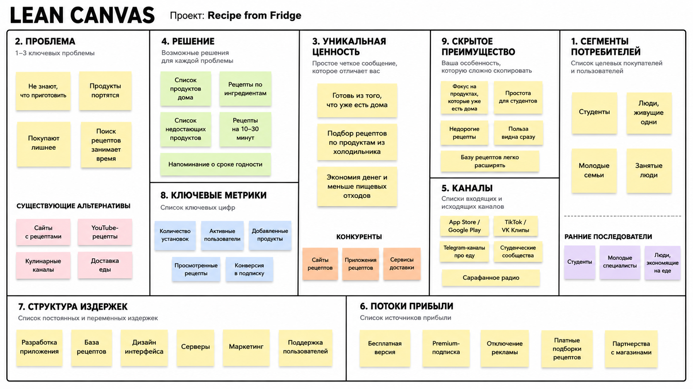

# Задание №1

## Название проекта

**Recipe from Fridge**

## Бизнес-модель

**B2C (Business-to-Consumer)**

## Elevator Pitch

Многие люди сталкиваются с ситуацией, когда дома в холодильнике есть какой-то набор продуктов, но непонятно, что из них приготовить. Из-за этого еда лежит ии портится, из-за чего деньги тратятся впустую, а пользователь идет за новыми продуктами или заказывает доставку.
Recipe from Fridge — это B2C-приложение, которое подбирает простые рецепты по продуктам, которые уже есть в холодильнике пользователя.
В отличие от обычных сайтов с рецептами, Recipe from Fridge сначала анализирует имеющиеся продукты и предлагает блюда без лишних покупок или с минимальным списком недостающих ингредиентов.
В результате пользователь экономит деньги, меньше выбрасывает продукты и быстрее решает вопрос, что ему сегодня приготовить.
## Lean Canvas

## Пояснение к Lean Canvas

### 1. Сегменты потребителей

Основные пользователи приложения — студенты, люди, живущие одни, молодые семьи и занятые люди. У этих групп часто есть проблема с планированием питания: продукты дома есть, но нет идеи, что из них приготовить.

Ранние последователи — студенты и молодые специалисты, которые хотят экономить деньги и быстрее готовить простые блюда.

### 2. Проблема

Главная проблема — пользователь не знает, что приготовить из имеющихся продуктов. Из-за этого продукты портятся, человек покупает лишнее или заказывает доставку. Также поиск подходящих рецептов в интернете занимает много времени.

Существующие альтернативы: сайты с рецептами, YouTube-рецепты, кулинарные Telegram-каналы и доставка еды.

### 3. Уникальная ценность

**Готовь из того, что уже есть дома.**

Recipe from Fridge отличается тем, что сначала учитывает продукты пользователя, а уже потом предлагает рецепты. Это помогает экономить деньги, время и уменьшать количество пищевых отходов.

### 4. Решение

Приложение позволяет пользователю вести список продуктов дома, подбирать рецепты по ингредиентам, видеть список недостающих продуктов и получать напоминания о сроке годности. Также в приложении будут простые рецепты на 10–30 минут.

### 5. Каналы

Основные каналы продвижения: App Store, Google Play, TikTok, VK Клипы, Telegram-каналы про еду, студенческие сообщества и сарафанное радио.

### 6. Потоки прибыли

Приложение может зарабатывать через бесплатную базовую версию с рекламой, Premium-подписку, отключение рекламы, платные подборки рецептов и партнерства с продуктовыми магазинами.

### 7. Структура издержек

Основные расходы: разработка мобильного приложения, создание базы рецептов, дизайн интерфейса, серверы, маркетинг и поддержка пользователей.

### 8. Ключевые метрики

Для оценки успеха проекта можно отслеживать количество установок, активных пользователей, количество добавленных продуктов, просмотренных рецептов и конверсию в подписку.

### 9. Скрытое преимущество

Скрытое преимущество проекта — узкий фокус на рецептах из продуктов, которые уже есть дома. Приложение простое для студентов и занятых людей, а польза видна сразу: пользователь экономит деньги и меньше выбрасывает продукты.
