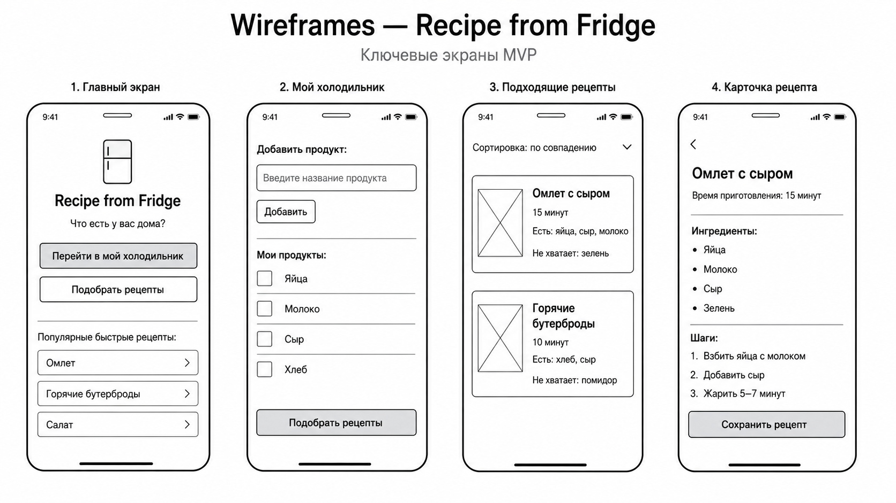

# Задание №3

## Проект

**Recipe from Fridge**

## Краткое описание проекта

**Recipe from Fridge** — это B2C-приложение, которое помогает пользователю подобрать рецепты по продуктам, которые уже есть дома.

Пользователь добавляет продукты из холодильника, а приложение предлагает подходящие рецепты, показывает недостающие ингредиенты и помогает меньше выбрасывать еду.

---

# 1. DDD: доменные зоны

DDD помогает разделить приложение на отдельные доменные зоны, чтобы каждая часть отвечала за свою бизнес-логику.

Для проекта **Recipe from Fridge** выделены 5 доменных зон:

1. Пользователь
2. Холодильник
3. Рецепты
4. Подбор рецептов
5. Монетизация

---

## 1.1. Доменная зона: Пользователь

### Описание

Зона отвечает за данные пользователя, его профиль, настройки и ограничения в питании.

### Основные функции

- регистрация и вход пользователя;
- хранение профиля;
- хранение предпочтений;
- хранение ограничений по питанию;
- хранение списка нелюбимых продуктов.

### Глоссарий

| Термин | Описание |
|---|---|
| Пользователь | Человек, который использует приложение для поиска рецептов |
| Профиль | Данные пользователя в приложении |
| Предпочтения | Настройки пользователя, влияющие на подбор рецептов |
| Ограничения питания | Аллергии, диеты или продукты, которые нельзя употреблять |
| Нелюбимые продукты | Продукты, которые пользователь не хочет видеть в рецептах |

---

## 1.2. Доменная зона: Холодильник

### Описание

Зона отвечает за список продуктов, которые есть у пользователя дома.

### Основные функции

- добавление продукта в холодильник;
- удаление продукта из холодильника;
- редактирование количества продукта;
- указание срока годности;
- просмотр списка продуктов дома.

### Глоссарий

| Термин | Описание |
|---|---|
| Холодильник | Список продуктов пользователя |
| Продукт | Ингредиент, который есть у пользователя дома |
| Количество | Объем или число единиц продукта |
| Срок годности | Дата, до которой продукт желательно использовать |
| Истекающий продукт | Продукт, срок годности которого скоро закончится |

---

## 1.3. Доменная зона: Рецепты

### Описание

Зона отвечает за базу рецептов и карточки блюд.

### Основные функции

- хранение рецептов;
- просмотр карточки рецепта;
- отображение ингредиентов;
- отображение шагов приготовления;
- отображение времени приготовления.

### Глоссарий

| Термин | Описание |
|---|---|
| Рецепт | Инструкция приготовления блюда |
| Блюдо | Результат приготовления по рецепту |
| Ингредиент | Продукт, необходимый для рецепта |
| Шаг приготовления | Отдельное действие в инструкции |
| Время приготовления | Сколько минут нужно для приготовления блюда |

---

## 1.4. Доменная зона: Подбор рецептов

### Описание

Зона отвечает за подбор подходящих рецептов на основе продуктов пользователя.

### Основные функции

- анализ продуктов из холодильника;
- поиск подходящих рецептов;
- расчет совпадения ингредиентов;
- определение недостающих ингредиентов;
- сортировка рецептов по релевантности.

### Глоссарий

| Термин | Описание |
|---|---|
| Подбор рецептов | Процесс поиска блюд по продуктам пользователя |
| Совпадение ингредиентов | Насколько рецепт подходит под продукты пользователя |
| Недостающий ингредиент | Ингредиент, которого нет у пользователя |
| Релевантность | Степень соответствия рецепта продуктам пользователя |
| Рекомендованный рецепт | Рецепт, который приложение предлагает пользователю |

---

## 1.5. Доменная зона: Монетизация

### Описание

Зона отвечает за платные функции приложения.

### Основные функции

- Premium-подписка;
- отключение рекламы;
- платные подборки рецептов;
- партнерские предложения от магазинов;
- управление доступом к платным функциям.

### Глоссарий

| Термин | Описание |
|---|---|
| Premium-подписка | Платный доступ к расширенным возможностям |
| Реклама | Бесплатная модель монетизации приложения |
| Платная подборка | Набор рецептов, доступный после оплаты |
| Партнерское предложение | Предложение от продуктового магазина |
| Платная функция | Возможность, доступная после оплаты |

---

# 2. BDD: критический путь MVP

## Критический путь MVP

Критический путь MVP — это главный пользовательский сценарий, который проверяет основную ценность продукта.

Для проекта **Recipe from Fridge** критический путь выглядит так:

1. Пользователь открывает приложение.
2. Пользователь переходит в раздел “Мой холодильник”.
3. Пользователь добавляет продукты, которые есть дома.
4. Пользователь нажимает кнопку “Подобрать рецепты”.
5. Система показывает список подходящих рецептов.
6. Пользователь открывает карточку рецепта.
7. Пользователь видит ингредиенты и шаги приготовления.

Этот путь выбран как критический, потому что он проверяет главную ценность продукта: пользователь может получить рецепт по продуктам из холодильника.

---

## Сценарий успеха

### Сценарий: пользователь получает подходящие рецепты по продуктам

**Дано:** пользователь находится на экране “Мой холодильник”.  
**И:** в списке продуктов есть “яйца”, “молоко”, “сыр” и “хлеб”.  
**И:** в базе приложения есть рецепты, которые используют эти продукты.  

**Когда:** пользователь нажимает кнопку “Подобрать рецепты”.  

**Тогда:** система показывает список подходящих рецептов.  
**И:** каждый рецепт содержит название блюда.  
**И:** каждый рецепт содержит время приготовления.  
**И:** каждый рецепт показывает имеющиеся и недостающие ингредиенты.  
**И:** рецепты с наибольшим совпадением ингредиентов отображаются выше.  

---

## Сценарий отказа

### Сценарий: подходящие рецепты не найдены

**Дано:** пользователь находится на экране “Мой холодильник”.  
**И:** в списке продуктов есть только “лимон” и “вода”.  
**И:** в базе приложения нет рецептов, подходящих под эти продукты.  

**Когда:** пользователь нажимает кнопку “Подобрать рецепты”.  

**Тогда:** система не показывает пустой экран.  
**И:** система выводит сообщение: “Подходящих рецептов пока нет”.  
**И:** система предлагает добавить больше продуктов.  
**И:** система показывает кнопку “Добавить продукты”.  

---

# 3. Wireframes

Wireframes показывают основной путь пользователя в MVP: от добавления продуктов до просмотра карточки рецепта.

В рамках задания подготовлены 4 ключевых экрана:

1. Главный экран
2. Мой холодильник
3. Подходящие рецепты
4. Карточка рецепта



---

## 3.1. Экран 1: Главный экран

### Назначение экрана

На главном экране пользователь понимает основную идею приложения и может перейти к списку своих продуктов или сразу попробовать подобрать рецепты.

### Основные элементы

- название приложения;
- краткий вопрос “Что есть у вас дома?”;
- кнопка “Перейти в мой холодильник”;
- кнопка “Подобрать рецепты”;
- блок популярных быстрых рецептов.

---

## 3.2. Экран 2: Мой холодильник

### Назначение экрана

На этом экране пользователь добавляет продукты, которые есть у него дома.

### Основные элементы

- поле ввода названия продукта;
- кнопка “Добавить”;
- список добавленных продуктов;
- кнопка “Подобрать рецепты”.

---

## 3.3. Экран 3: Подходящие рецепты

### Назначение экрана

На этом экране пользователь видит рецепты, которые можно приготовить из имеющихся продуктов.

### Основные элементы

- сортировка по совпадению;
- карточки рецептов;
- время приготовления;
- список имеющихся ингредиентов;
- список недостающих ингредиентов.

---

## 3.4. Экран 4: Карточка рецепта

### Назначение экрана

На этом экране пользователь получает подробную инструкцию по приготовлению блюда.

### Основные элементы

- название рецепта;
- время приготовления;
- список ингредиентов;
- пошаговая инструкция;
- кнопка “Сохранить рецепт”.

---

# 4. API-First: JSON-контракты

API-First означает, что фронтенд и бэкенд заранее договариваются о формате запросов и ответов.

Для MVP проекта **Recipe from Fridge** выбраны две основные API-ручки:

1. Добавление продукта в холодильник.
2. Подбор рецептов по продуктам.

---

## 4.1. API-ручка: добавление продукта в холодильник

### Назначение

Добавляет продукт в список продуктов пользователя.

### Метод

```http
POST /api/v1/fridge/items
