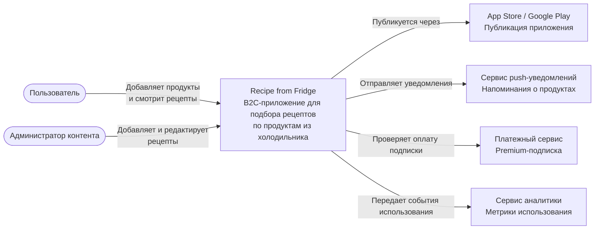
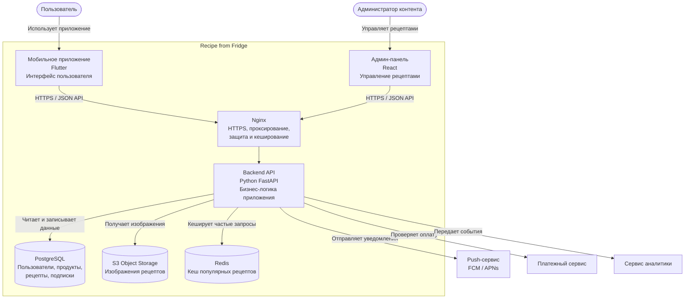

# Практическое задание №4

## Проект

**Recipe from Fridge**

## Краткое описание проекта

**Recipe from Fridge** — это B2C-приложение, которое помогает пользователю подобрать рецепты по продуктам, которые уже есть дома.

Пользователь добавляет продукты из холодильника, а приложение предлагает подходящие рецепты, показывает недостающие ингредиенты и помогает меньше выбрасывать еду.

---

# 1. C4: Уровень 1 — Контекст системы

На уровне контекста показывается система целиком, пользователи и внешние сервисы, с которыми взаимодействует приложение.

## Описание контекста

### Пользователь

Основной клиент приложения. Он добавляет продукты, которые есть дома, и получает список подходящих рецептов.

### Администратор контента

Пользователь с внутренней ролью. Он добавляет, редактирует и проверяет рецепты в базе приложения.

### Recipe from Fridge

Основная система, которую мы разрабатываем. Она отвечает за хранение продуктов пользователя, подбор рецептов, отображение карточек рецептов и базовую монетизацию.

### Внешние системы

- **App Store / Google Play** — используются для публикации мобильного приложения.
- **Сервис push-уведомлений** — используется для напоминаний о продуктах, срок годности которых скоро закончится.
- **Платежный сервис** — используется для оплаты Premium-подписки.
- **Сервис аналитики** — используется для сбора метрик: установки, активные пользователи, просмотренные рецепты, конверсия в подписку.

---

# 2. C4: Уровень 2 — Контейнеры

На уровне контейнеров показывается, из каких крупных технических частей состоит система.

## Описание контейнеров

### 1. Мобильное приложение

**Назначение:**  
Основной интерфейс пользователя.

**Что делает:**

- показывает главный экран;
- позволяет добавить продукты в холодильник;
- показывает список подходящих рецептов;
- открывает карточку рецепта;
- позволяет сохранить рецепт;
- отправляет запросы на Backend API.

---

### 2. Админ-панель

**Назначение:**  
Интерфейс для администратора контента.

**Что делает:**

- добавляет новые рецепты;
- редактирует рецепты;
- управляет ингредиентами;
- проверяет корректность карточек рецептов.

---

### 3. Backend API

**Назначение:**  
Главная серверная часть приложения.

**Что делает:**

- принимает запросы от мобильного приложения;
- хранит продукты пользователя;
- подбирает рецепты по ингредиентам;
- рассчитывает недостающие продукты;
- управляет пользователями;
- работает с подписками;
- отправляет события в аналитику.

---

### 4. PostgreSQL

**Назначение:**  
Основная база данных приложения.

**Что хранит:**

- пользователей;
- продукты пользователя;
- рецепты;
- ингредиенты;
- связи между рецептами и ингредиентами;
- избранные рецепты;
- информацию о подписках.

---

### 5. S3 Object Storage

**Назначение:**  
Хранение файлов.

**Что хранит:**

- изображения рецептов;
- иконки блюд;
- дополнительные медиафайлы.

---

### 6. Redis

**Назначение:**  
Кеширование часто используемых данных.

**Что кеширует:**

- популярные рецепты;
- результаты частых поисковых запросов;
- временные данные сессий.

Для MVP Redis можно добавить не сразу, но он полезен при росте нагрузки.

---

### 7. Nginx

**Назначение:**  
Входная точка для запросов к backend.

**Что делает:**

- принимает HTTPS-запросы;
- проксирует запросы на Backend API;
- помогает фильтровать опасные запросы;
- может кешировать статические ответы;
- упрощает настройку HTTPS.

---

# 3. Выбор технологического стека

## 3.1. Мобильное приложение

**Технология:** Flutter

### Почему Flutter

- Позволяет разрабатывать приложение сразу под Android и iOS.
- Подходит для MVP, потому что ускоряет разработку.
- Один код можно использовать для двух платформ.
- Хорошо подходит для B2C-приложения с простым интерфейсом.

---

## 3.2. Backend API

**Технология:** Python FastAPI

### Почему FastAPI

- Быстро разрабатывать MVP.
- Удобно описывать REST API.
- Автоматически формирует OpenAPI/Swagger-документацию.
- Хорошо подходит для API-First подхода.
- Достаточно производителен для первой версии продукта.

---

## 3.3. База данных

**Технология:** PostgreSQL

### Почему PostgreSQL

- Надежная реляционная база данных.
- Хорошо подходит для хранения пользователей, рецептов, ингредиентов и связей между ними.
- Удобно работать со сложными связями: рецепт — ингредиенты — продукты пользователя.
- Подходит для дальнейшего масштабирования.

---

## 3.4. Хранение изображений

**Технология:** S3 Object Storage

### Почему S3

- Удобно хранить изображения рецептов отдельно от backend.
- Можно масштабировать хранение файлов.
- Backend не перегружается хранением картинок.
- Подходит для будущего роста базы рецептов.

---

## 3.5. Кеширование

**Технология:** Redis

### Почему Redis

- Позволяет ускорить выдачу популярных рецептов.
- Можно кешировать частые поисковые запросы.
- Помогает снизить нагрузку на базу данных.

### Важно

Для самой первой версии MVP Redis можно не внедрять сразу. Его можно добавить после появления первых пользователей и понимания нагрузки.

---

## 3.6. Веб-сервер и прокси

**Технология:** Nginx

### Почему Nginx

- Удобная настройка HTTPS.
- Проксирование запросов к backend.
- Фильтрация опасных запросов.
- Возможность кеширования.
- Подходит для production-развертывания.

---

## 3.7. Админ-панель

**Технология:** React

### Почему React

- Удобно быстро сделать веб-интерфейс для администратора.
- Большая экосистема готовых компонентов.
- Подходит для CRUD-операций с рецептами и ингредиентами.
- Можно развивать отдельно от мобильного приложения.

---

## 3.8. Контейнеризация

**Технология:** Docker

### Почему Docker

- Упрощает запуск проекта на разных машинах.
- Позволяет отдельно запускать backend, базу данных и Redis.
- Удобен для разработки и деплоя.
- Помогает избежать проблемы “у меня на компьютере работает”.

---

## 3.9. Документация API

**Технология:** OpenAPI / Swagger

### Почему Swagger

- Соответствует API-First подходу.
- Позволяет фронтенду и бэкенду заранее договориться о контрактах.
- Упрощает тестирование API.
- FastAPI поддерживает Swagger автоматически.

---

## 3.10. Аналитика

**Технология:** Firebase Analytics или AppMetrica

### Почему

- Можно отслеживать установки приложения.
- Можно смотреть активных пользователей.
- Можно анализировать, какие рецепты чаще открывают.
- Можно отслеживать конверсию в подписку.

---

# 4. Итоговая таблица стека

| Часть системы | Технология | Зачем нужна |
|---|---|---|
| Мобильное приложение | Flutter | Android и iOS из одной кодовой базы |
| Backend API | Python FastAPI | Быстрая разработка API для MVP |
| База данных | PostgreSQL | Хранение пользователей, продуктов и рецептов |
| Хранение файлов | S3 Object Storage | Хранение изображений рецептов |
| Кеширование | Redis | Ускорение популярных запросов |
| Веб-сервер | Nginx | HTTPS, проксирование, защита |
| Админ-панель | React | Управление рецептами и ингредиентами |
| Контейнеризация | Docker | Удобный запуск и деплой |
| API-документация | OpenAPI / Swagger | Документация JSON-контрактов |
| Аналитика | Firebase Analytics / AppMetrica | Анализ поведения пользователей |

---

# 5. Почему этот стек подходит для MVP

Для MVP важно быстро проверить основную гипотезу:

> Пользователю полезно приложение, которое подбирает рецепты по продуктам, уже имеющимся дома.

Выбранный стек помогает быстро собрать первую версию:

- Flutter ускоряет мобильную разработку.
- FastAPI позволяет быстро сделать backend и API.
- PostgreSQL надежно хранит данные.
- Swagger помогает согласовать API между frontend и backend.
- Docker упрощает запуск проекта.
- Nginx и S3 позволяют подготовить проект к production-развертыванию.

На первом этапе можно сделать упрощенную версию без Redis и сложной монетизации, а затем добавить эти элементы после проверки спроса.

---

# 6. Вывод

В рамках практического задания №4 были подготовлены:

1. **C4 Level 1 — Context diagram**: показаны пользователи, система и внешние сервисы.
2. **C4 Level 2 — Container diagram**: показаны основные технические контейнеры приложения.
3. **Технологический стек MVP**: выбран и обоснован набор технологий для разработки первой версии продукта.

Проект **Recipe from Fridge** можно реализовать как мобильное приложение с backend API, базой данных рецептов, админ-панелью и внешними интеграциями для уведомлений, аналитики и платежей.
