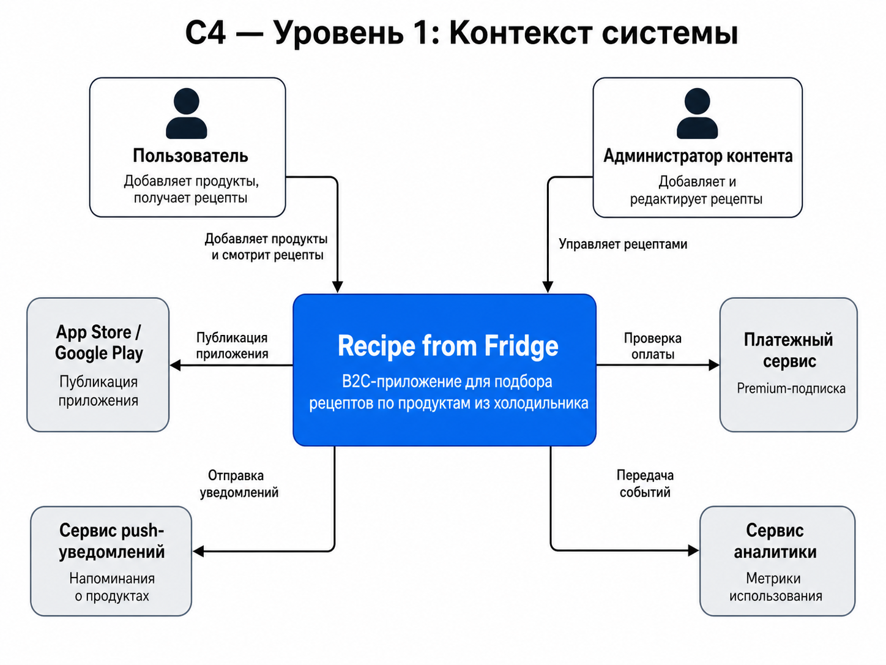
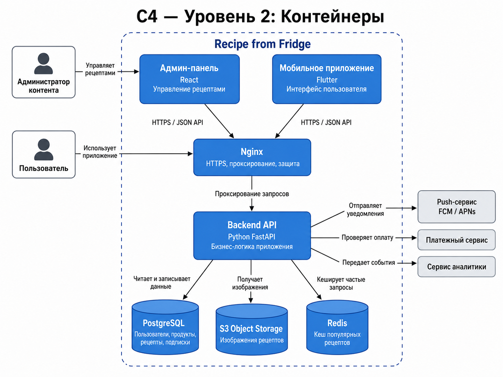

# Задание №4

## Проект

**Recipe from Fridge**

## Краткое описание проекта

**Recipe from Fridge** — это B2C-приложение, которое помогает пользователю подобрать рецепты по продуктам, которые уже есть дома.

Пользователь добавляет продукты из холодильника, а приложение предлагает подходящие рецепты, показывает недостающие ингредиенты и помогает меньше выбрасывать еду.

---

# 1. C4: Уровень 1 — Контекст системы

На уровне контекста показывается система целиком, основные пользователи и внешние сервисы, с которыми взаимодействует приложение.

## Диаграмма контекста

## Пояснение к диаграмме

### Пользователь
Основной клиент приложения. Он добавляет продукты, которые есть дома, и получает список подходящих рецептов.

### Администратор контента
Внутренний пользователь системы. Он добавляет, редактирует и проверяет рецепты в базе приложения.

### Recipe from Fridge
Основная система, которую мы разрабатываем. Она отвечает за хранение продуктов пользователя, подбор рецептов, отображение карточек рецептов и базовую монетизацию.

### App Store / Google Play
Используются для публикации мобильного приложения.

### Сервис push-уведомлений
Используется для отправки напоминаний о продуктах, срок годности которых скоро закончится.

### Платежный сервис
Используется для оплаты Premium-подписки.

### Сервис аналитики
Используется для сбора метрик: установки, активные пользователи, просмотренные рецепты и конверсия в подписку.

---

# 2. C4: Уровень 2 — Контейнеры

На уровне контейнеров показывается, из каких крупных технических частей состоит система.

## Диаграмма контейнеров

## Пояснение к диаграмме

### 1. Мобильное приложение
**Назначение:** основной интерфейс пользователя.

**Функции:**
- показывает главный экран;
- позволяет добавить продукты в холодильник;
- показывает список подходящих рецептов;
- открывает карточку рецепта;
- отправляет запросы на backend API.

---

### 2. Админ-панель
**Назначение:** интерфейс для администратора контента.

**Функции:**
- добавление рецептов;
- редактирование рецептов;
- управление ингредиентами;
- проверка карточек рецептов.

---

### 3. Nginx
**Назначение:** входная точка для запросов к backend.

**Функции:**
- принимает HTTPS-запросы;
- проксирует запросы на backend API;
- помогает с базовой защитой;
- упрощает настройку HTTPS.

---

### 4. Backend API
**Назначение:** главная серверная часть приложения.

**Функции:**
- принимает запросы от мобильного приложения;
- хранит продукты пользователя;
- подбирает рецепты по ингредиентам;
- рассчитывает недостающие продукты;
- управляет пользователями;
- работает с подписками;
- отправляет события в аналитику.

---

### 5. PostgreSQL
**Назначение:** основная база данных приложения.

**Что хранит:**
- пользователей;
- продукты пользователя;
- рецепты;
- ингредиенты;
- избранные рецепты;
- подписки.

---

### 6. S3 Object Storage
**Назначение:** хранение файлов.

**Что хранит:**
- изображения рецептов;
- изображения блюд;
- дополнительные медиафайлы.

---

### 7. Redis
**Назначение:** кеширование часто используемых данных.

**Что кеширует:**
- популярные рецепты;
- результаты частых поисковых запросов;
- временные данные.

---

### 8. Push-сервис
Используется для отправки уведомлений пользователю.

---

### 9. Платежный сервис
Используется для проверки и обработки оплаты Premium-подписки.

---

### 10. Сервис аналитики
Используется для сбора продуктовых и пользовательских метрик.

---

# 3. Выбор технологического стека

Для MVP важно быстро проверить основную гипотезу:

> Пользователю полезно приложение, которое подбирает рецепты по продуктам, уже имеющимся дома.

Ниже выбран стек технологий, который подходит для быстрой разработки MVP.

---

## 3.1. Мобильное приложение

**Технология:** Flutter

### Почему Flutter
- позволяет разрабатывать приложение сразу под Android и iOS;
- ускоряет создание MVP;
- одна кодовая база для двух платформ;
- хорошо подходит для B2C-приложения.

---

## 3.2. Backend API

**Технология:** Python FastAPI

### Почему FastAPI
- быстро разрабатывать MVP;
- удобно проектировать REST API;
- хорошо сочетается с API-First подходом;
- автоматически создает Swagger / OpenAPI документацию;
- достаточно производителен для первой версии продукта.

---

## 3.3. База данных

**Технология:** PostgreSQL

### Почему PostgreSQL
- надежная реляционная база данных;
- хорошо подходит для хранения пользователей, рецептов и ингредиентов;
- удобно работать со связями между сущностями;
- подходит для масштабирования.

---

## 3.4. Хранение изображений

**Технология:** S3 Object Storage

### Почему S3
- удобно хранить изображения рецептов отдельно от backend;
- легко масштабируется;
- уменьшает нагрузку на сервер приложения.

---

## 3.5. Кеширование

**Технология:** Redis

### Почему Redis
- ускоряет выдачу популярных рецептов;
- уменьшает нагрузку на базу данных;
- полезен при росте количества пользователей.

**Примечание:**  
Для самой первой версии MVP Redis можно не внедрять сразу, а добавить позже.

---

## 3.6. Веб-сервер и прокси

**Технология:** Nginx

### Почему Nginx
- удобная настройка HTTPS;
- проксирование запросов;
- базовая защита;
- подходит для production-развертывания.

---

## 3.7. Админ-панель

**Технология:** React

### Почему React
- удобно быстро сделать веб-интерфейс для администратора;
- большая экосистема;
- хорошо подходит для CRUD-операций.

---

## 3.8. Контейнеризация

**Технология:** Docker

### Почему Docker
- упрощает запуск проекта;
- удобно разделять backend, базу данных и дополнительные сервисы;
- помогает при деплое и совместной разработке.

---

## 3.9. Документация API

**Технология:** OpenAPI / Swagger

### Почему Swagger
- соответствует API-First подходу;
- помогает согласовать frontend и backend;
- упрощает тестирование API.

---

## 3.10. Аналитика

**Технология:** Firebase Analytics или AppMetrica

### Почему
- позволяет отслеживать установки;
- позволяет смотреть активных пользователей;
- помогает анализировать популярные рецепты;
- позволяет оценивать конверсию в подписку.

---

# 4. Итоговая таблица стека

| Часть системы | Технология | Зачем нужна |
|---|---|---|
| Мобильное приложение | Flutter | Android и iOS из одной кодовой базы |
| Backend API | Python FastAPI | Быстрая разработка API для MVP |
| База данных | PostgreSQL | Хранение пользователей, продуктов и рецептов |
| Хранение файлов | S3 Object Storage | Хранение изображений рецептов |
| Кеширование | Redis | Ускорение популярных запросов |
| Веб-сервер | Nginx | HTTPS, проксирование, защита |
| Админ-панель | React | Управление рецептами и ингредиентами |
| Контейнеризация | Docker | Удобный запуск и деплой |
| API-документация | OpenAPI / Swagger | Документация API |
| Аналитика | Firebase Analytics / AppMetrica | Анализ поведения пользователей |

---

# 5. Почему этот стек подходит для MVP

Выбранный стек помогает быстро собрать первую версию продукта:

- Flutter ускоряет мобильную разработку.
- FastAPI позволяет быстро сделать backend и API.
- PostgreSQL надежно хранит данные.
- Swagger помогает согласовать API.
- Docker упрощает запуск проекта.
- Nginx и S3 позволяют подготовить проект к реальному развертыванию.

На первом этапе можно сделать упрощенную версию без Redis и сложной монетизации, а затем добавить эти элементы после проверки спроса.

---

# 6. Вывод

В рамках практического задания №4 были подготовлены:

1. **C4 Level 1 — Context diagram**: показаны пользователи, система и внешние сервисы.
2. **C4 Level 2 — Container diagram**: показаны основные технические контейнеры приложения.
3. **Технологический стек MVP**: выбран и обоснован набор технологий для разработки первой версии продукта.

Проект **Recipe from Fridge** можно реализовать как мобильное приложение с backend API, базой данных рецептов, админ-панелью и внешними интеграциями для уведомлений, аналитики и платежей.
